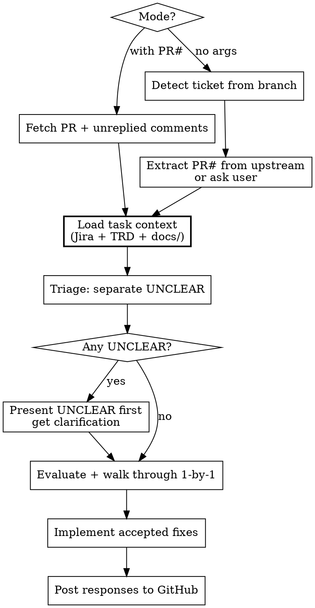

# Address Review

Evaluate and respond to PR review comments grounded in task context — Jira requirements, TRD contracts, and implementation decisions.

**Core principle:** Load task context BEFORE evaluating any comment. Evidence must cite requirements (TRD, Jira AC, plan rationale) first — convention citations are a last resort.

**REQUIRED SUB-SKILL:** `superpowers:receiving-code-review` (behavioral discipline — no performative agreement, verify before implementing, push back when wrong)

## Usage

```text
/address-review <PR#>       # Full orchestration: fetch comments + context + evaluate
/address-review              # Context-aware: comments already in conversation
```

## Constants

| Key | Value |
|-----|-------|
| GitHub Repo | `bfi-finance/bravo-bpm-service` |
| GitHub Account | `bfi-roni-yusuf` |
| GH_HOST prefix | `GH_HOST=github.com` |
| Known Reviewers | `herfanh` (Herfan), `selfhygtg` (Selfhy) |

## Workflow



### Phase 1: Gather Comments

**Mode 1 (with PR#):**

1. Switch auth and fetch PR:
   ```bash
   gh auth switch --user bfi-roni-yusuf 2>/dev/null && GH_HOST=github.com gh pr view <PR#> --repo bfi-finance/bravo-bpm-service
   ```
2. Extract ticket ID — from PR title `[BLCS-XXXX]` or branch name `feat/BLCS-XXXX`
3. Fetch unreplied comments (see [Comment Detection](#comment-detection) below)

**Mode 2 (no args):**

1. Extract ticket from current branch: `git branch --show-current` → `feat/BLCS-XXXX` → `BLCS-XXXX`
2. Comments are whatever the user references in conversation. If context is insufficient (no file/line), ask: "Which file and line is this comment about?"
3. PR# is needed for posting responses — extract from upstream:
   ```bash
   gh auth switch --user bfi-roni-yusuf 2>/dev/null && GH_HOST=github.com gh pr list --repo bfi-finance/bravo-bpm-service --head $(git branch --show-current) --json number --jq '.[0].number'
   ```
   If no upstream PR found, ask the user.

### Phase 2: Load Task Context

**This is the critical step. Do NOT skip or defer this.**

Load context in priority order — local docs first, Jira as fallback:

1. **Analysis doc** — read `docs/<ticket-id>/analysis.md` if it exists
2. **Plan doc** — read `docs/<ticket-id>/plan.md` if it exists
3. **Jira ticket + TRD (fallback only)** — invoke `/fetch-jira-context <ticket-id>` ONLY if neither analysis nor plan was found. By this stage, local docs already contain the distilled TRD contracts, acceptance criteria, and business rules from planning — re-fetching from Jira/Confluence is redundant.

Report what was loaded:
```text
Context loaded:
  Analysis: docs/blcs-2651/analysis.md ✓
  Plan: docs/blcs-2651/plan.md ✓
  Jira: skipped (local docs sufficient)
```

Or when falling back:
```text
Context loaded:
  Analysis: not found
  Plan: not found
  Jira: BLCS-2651 — CFCAT Non Asset Save (fallback)
  TRD: Page 12345 (section 4.2 extracted)
```

**Minimum viable context:** At least ONE source must be available (local docs OR Jira). If all fail, warn: "No task context available — falling back to codebase-only evaluation (equivalent to receiving-code-review without requirements grounding)." Proceed but note reduced evaluation depth.

### Phase 3: Triage

Do a quick pass over all comments and separate:
- **UNCLEAR** — can't determine validity without more info from the reviewer
- **VALID / INVALID** — can evaluate with available evidence

If any UNCLEAR items exist, present them to the user FIRST and get clarification before evaluating anything else. This prevents partial understanding from leading to wrong implementations.

### Phase 4: Evaluate & Walk Through

Present each comment to the user ONE AT A TIME:

```text
Comment #1 by herfanh (CollateralValuationServiceImpl.java:45):
  "You should add a null check for reviewSummary"

Verdict: INVALID
Evidence: Plan step 1 states reviewSummary is fetched via findById which
  throws NOT_FOUND if absent. TRD section 3.1 has no null-summary scenario.
  Verified: findById at line 62 does throw BravoCommonException(NOT_FOUND).
Suggested pushback: "reviewSummary is fetched via findById which throws
  NOT_FOUND if absent — null is unreachable at this point."

Accept / Skip / Push back?
```

Wait for the user's decision on each comment before presenting the next.

#### Evidence Hierarchy

When building the "Evidence" line, cite sources in this order of strength:

1. **TRD contract** — "TRD section 4.2 specifies BravoCommonResponse for this endpoint"
2. **Jira acceptance criteria** — "AC #3 requires scoped collateral query"
3. **Plan/analysis rationale** — "Plan step 3 chose workflow-level gating over endpoint validation"
4. **Codebase pattern** — "All 15 BaseResponse subclasses use this annotation"
5. **CLAUDE.md convention** — LAST RESORT. Never cite CLAUDE.md line numbers in pushback text.

**Why this order matters:** "TRD says X" is a requirements argument a reviewer respects. "CLAUDE.md says X" is an internal convention argument that sounds defensive. The baseline showed agents default to CLAUDE.md — this skill forces requirements-first reasoning.

### Phase 5: Implement Accepted Fixes

- Group fixes by file to minimize context switching
- One fix at a time
- Single batch commit after all fixes: `fix(scope): address review feedback`
- Push before posting responses

**Baseline skill compliance on fixes:**
When implementing accepted review fixes, follow baseline skills (java-springboot, java-junit, java-docs) for new code patterns. Specifically:
- New test methods added as part of a fix use JUnit 5 patterns (@ParameterizedTest, @Nested, @DisplayName, descriptive naming)
- New production code follows java-springboot patterns where bpm-conventions is silent
- Don't refactor surrounding code to match baseline skills — only the fix itself

### Phase 6: Post Responses to GitHub

For each comment with a user decision:
- **Accepted:** reply in-thread with brief fix description (e.g., "Fixed — added `@EqualsAndHashCode(callSuper = false)`")
- **Push back:** reply in-thread with technical reasoning citing requirements (NEVER cite CLAUDE.md)
- **Skipped:** no reply (user handles manually if needed)

Post replies using thread reply endpoint:
```bash
gh auth switch --user bfi-roni-yusuf 2>/dev/null && GH_HOST=github.com gh api \
  repos/bfi-finance/bravo-bpm-service/pulls/<PR#>/comments/<comment-id>/replies \
  -f body="<response>"
```

**Does NOT:** resolve GitHub conversations, transition Jira status, re-request review.

## Comment Detection

Fetch all review comments:
```bash
gh auth switch --user bfi-roni-yusuf 2>/dev/null && GH_HOST=github.com gh api \
  repos/bfi-finance/bravo-bpm-service/pulls/<PR#>/comments --paginate
```

Filter for unreplied using a jq script (write to `/tmp/filter-unreplied.jq` — inline jq `!=` breaks in zsh):

1. Group into threads — top-level: `in_reply_to_id == null`, replies: `in_reply_to_id != null`
2. For each thread, find the last reply by `bfi-roni-yusuf`
3. **Unreplied** = reviewer comments with `created_at` AFTER the author's last reply
4. Top-level with zero author replies = also unreplied

Include comments from unknown reviewers but flag them as "unknown reviewer."

## Red Flags — You're Skipping Context

If you catch yourself doing any of these, STOP and go back to Phase 2:

- Evaluating a comment before loading Jira/TRD/plan
- Citing "CLAUDE.md line X" as primary evidence for pushback
- Dumping all evaluations at once instead of walking through 1-by-1
- Implementing fixes before clarifying UNCLEAR items
- Saying "Great point!" or "You're absolutely right!" to a reviewer comment

## Workflow Tracking

**REQUIRED SUB-SKILL:** After Phase 6 completes (responses posted to GitHub), use `update-workflow` to mark phase `address_review` as `done`.
